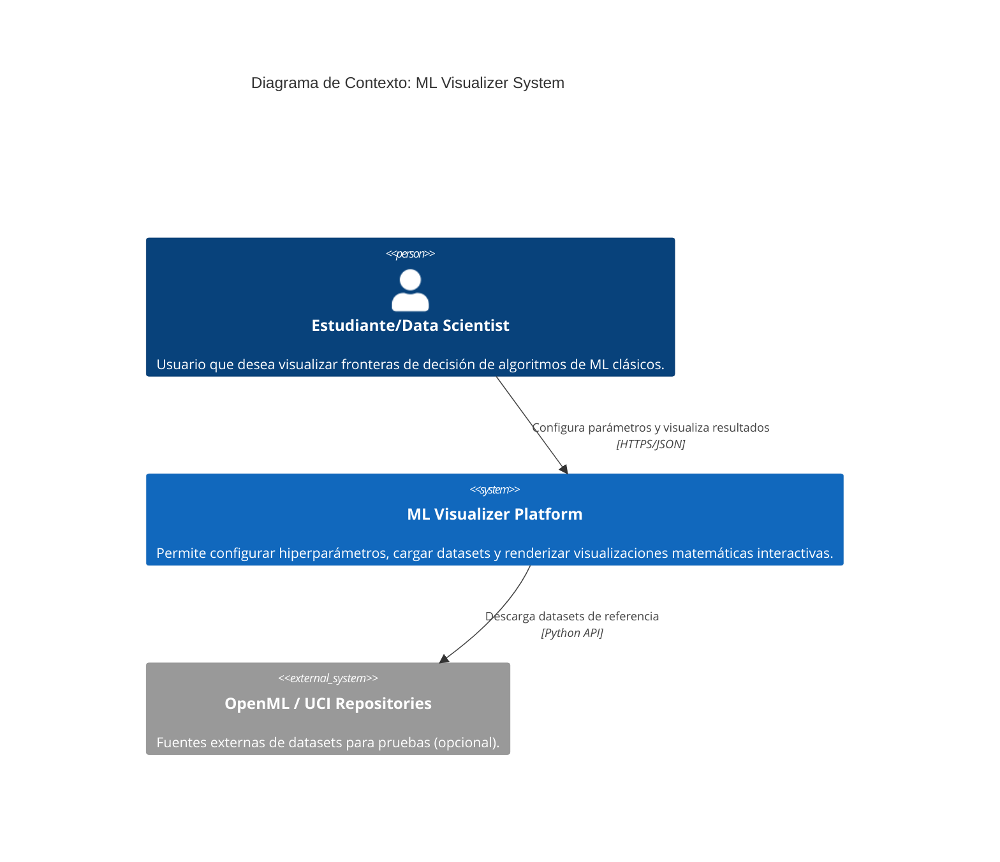
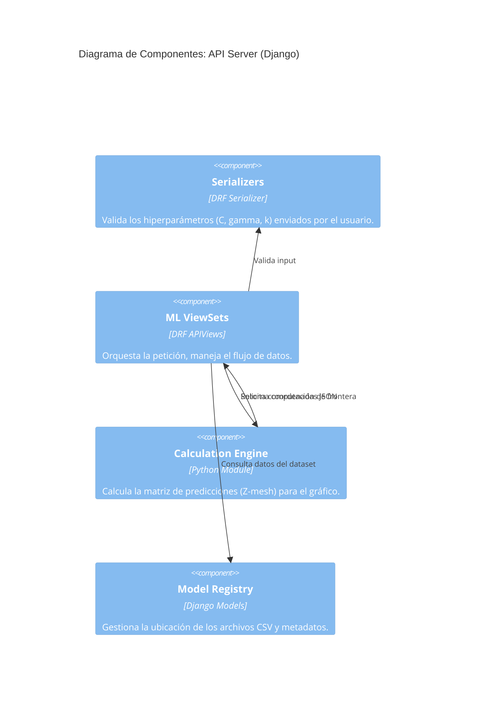
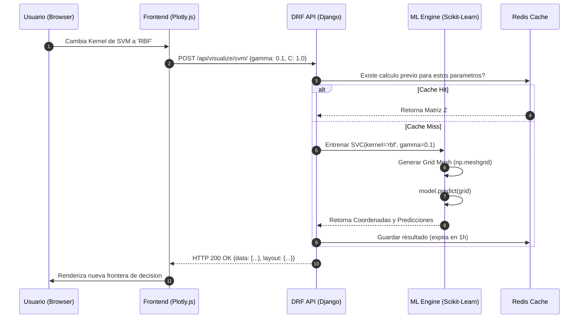

# Arquitectura ML Visualizer — Modelo C4

---

## Nivel 1: Diagrama de Contexto

Muestra cómo el sistema interactúa con el mundo exterior.



---

## Nivel 2: Diagrama de Contenedores

Muestra la infraestructura dentro de Docker y cómo DRF controla la comunicación.

```mermaid
C4Container
    title Diagrama de Contenedores: ML Visualizer

    Container(ui, "Frontend SPA", "React / Plotly.js", "Interfaz de usuario reactiva para el control de gráficas.")

    ContainerBoundary(c1, "Docker Cluster") {
        Container(api, "API Server (Django + DRF)", "Python, Gunicorn", "Expone endpoints REST, gestiona autenticación y lógica de negocio.")
        Container(worker, "ML Engine", "Scikit-Learn, NumPy", "Módulo especializado en computación matemática y entrenamiento de modelos.")
        ContainerDb(db, "Database", "PostgreSQL", "Almacena metadatos de datasets y configuraciones de experimentos.")
        Container(cache, "Cache", "Redis", "Almacena resultados de fronteras de decisión pesadas para acceso rápido.")
    }

    Rel(ui, api, "Peticiones de inferencia y visualización", "JSON/HTTPS")
    Rel(api, worker, "Llama funciones de entrenamiento", "In-process call")
    Rel(api, db, "Lectura/Escritura", "SQL")
    Rel(api, cache, "Persistencia temporal", "Protocolo Redis")
```

---

## Nivel 3: Diagrama de Componentes

Desglosa cómo se organiza Django REST Framework para procesar la IA.



---

## Diagrama de Secuencia: Flujo de Inferencia

Detalla la interacción exacta desde que el usuario hace clic hasta que el gráfico se actualiza.


