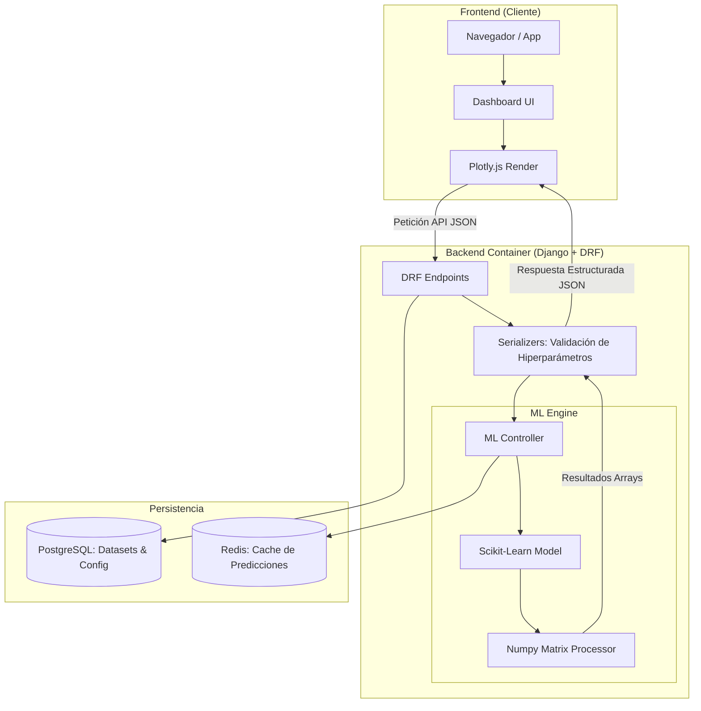
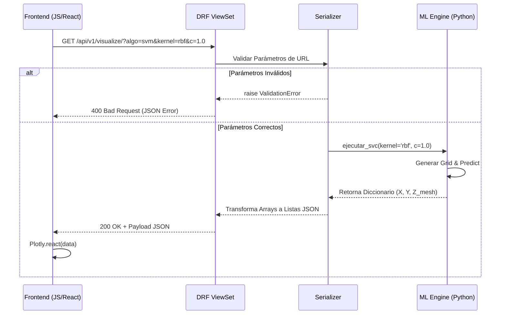
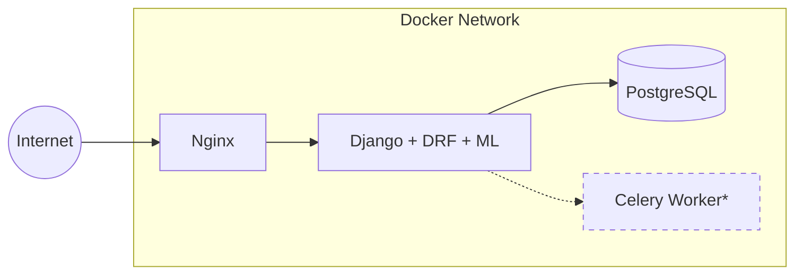

# ML Visualizer Dashboard 🚀

Esta aplicación es una plataforma interactiva diseñada para la visualización de modelos de Machine Learning en tiempo real. Permite a los usuarios ajustar hiperparámetros desde una interfaz web y observar instantáneamente cómo cambian las fronteras de decisión o los resultados del modelo mediante gráficos dinámicos.

---

## 🏗️ Arquitectura del Sistema

El proyecto sigue una arquitectura de N-Capas desacoplada, facilitando la escalabilidad del motor de ML y la persistencia de datos.

### Componentes Principales

| Componente | Tecnología | Responsabilidad |
|---|---|---|
| **Frontend** | React / JS + Plotly.js | Renderizado interactivo de gráficas y matrices de datos |
| **Backend** | Django REST Framework | Orquestación, validación de hiperparámetros y exposición de la API |
| **ML Engine** | Scikit-Learn + Numpy | Cómputo de modelos y manipulación de matrices (Decision Boundaries) |
| **Base de Datos** | PostgreSQL | Almacena configuraciones, metadatos de modelos y datasets |
| **Caché** | Redis | Evita el re-entrenamiento ante peticiones con parámetros idénticos |

---

## 🔄 Flujo de Comunicación (Request-Response)

El siguiente diagrama detalla el ciclo de vida de una petición cuando un usuario solicita una visualización específica (ej. un SVM con kernel RBF).

> **Nota técnica:** Los Serializers de Django juegan un papel crítico aquí, transformando los `ndarrays` de Numpy (no serializables) en listas estándar de Python para poder ser enviadas vía JSON.

---

## 🐳 Infraestructura y Despliegue

La aplicación está completamente dockerizada para garantizar la paridad entre los entornos de desarrollo y producción.

| Servicio | Rol |
|---|---|
| **Nginx** | Proxy Inverso: maneja la terminación SSL y sirve archivos estáticos |
| **Django + ML** | Contenedor core que ejecuta la lógica de negocio |
| **Celery Worker** | *(Opcional)* Tareas de entrenamiento pesado fuera del ciclo HTTP |
